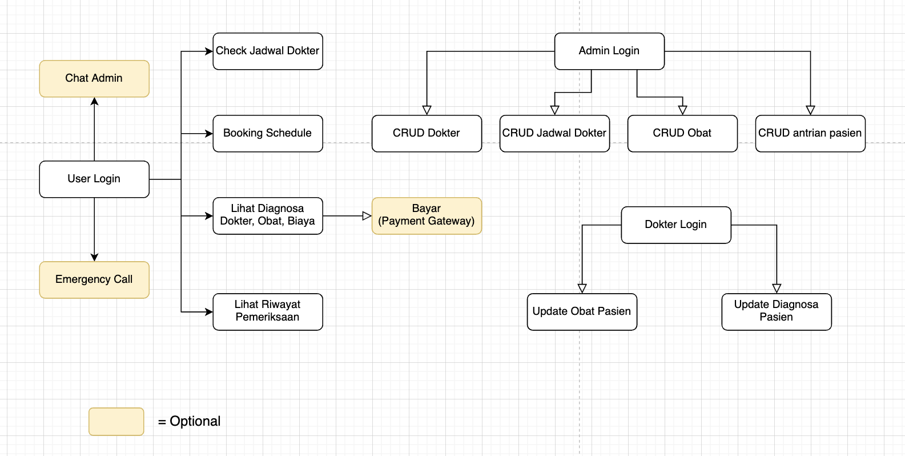

# hospiCare
> Final Project Hacktiv8

Hospicare's intentions are straightforward. It helps those who are in need of medical care especially in this current pandemic. Hospicare let users find the nearest hospital along with information about it's vacant rooms, selection of doctors, and book services according to their needs. Users can also pay their bills with multiple payment gateway.

 

> Flow App

 

> Schema Databases

